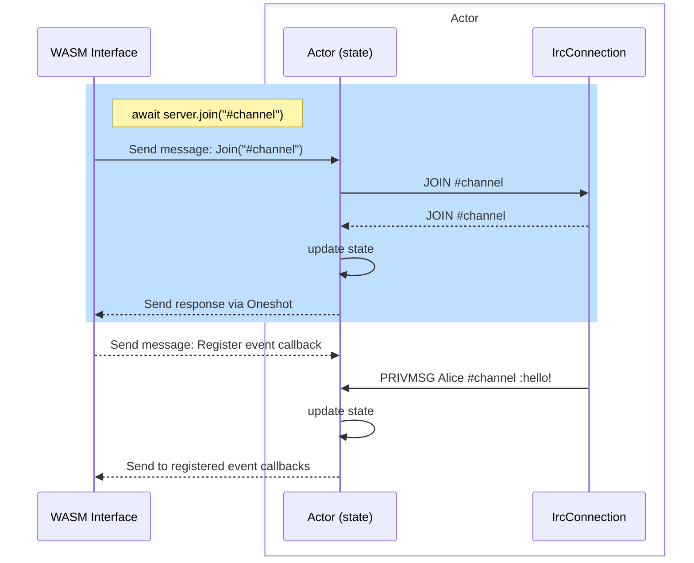

# core-wasm

This library builds upon core-shared to provide an easy-to-use IRC interface. To
simplify server communication, the connection is abstracted into a stateful
actor. When the actor receives a matching reply from the IRC server, it routes
it back to the sender via oneshot channels. Additionally, it allows you to
configure callbacks for events, errors, and disconnections.

